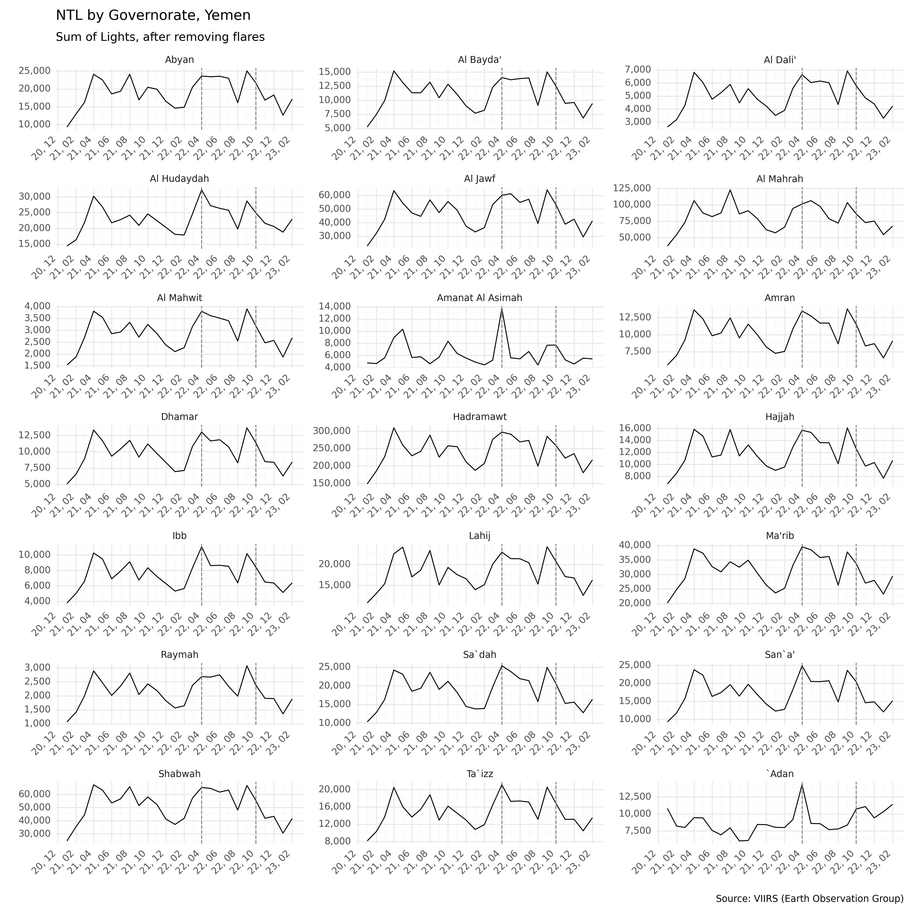
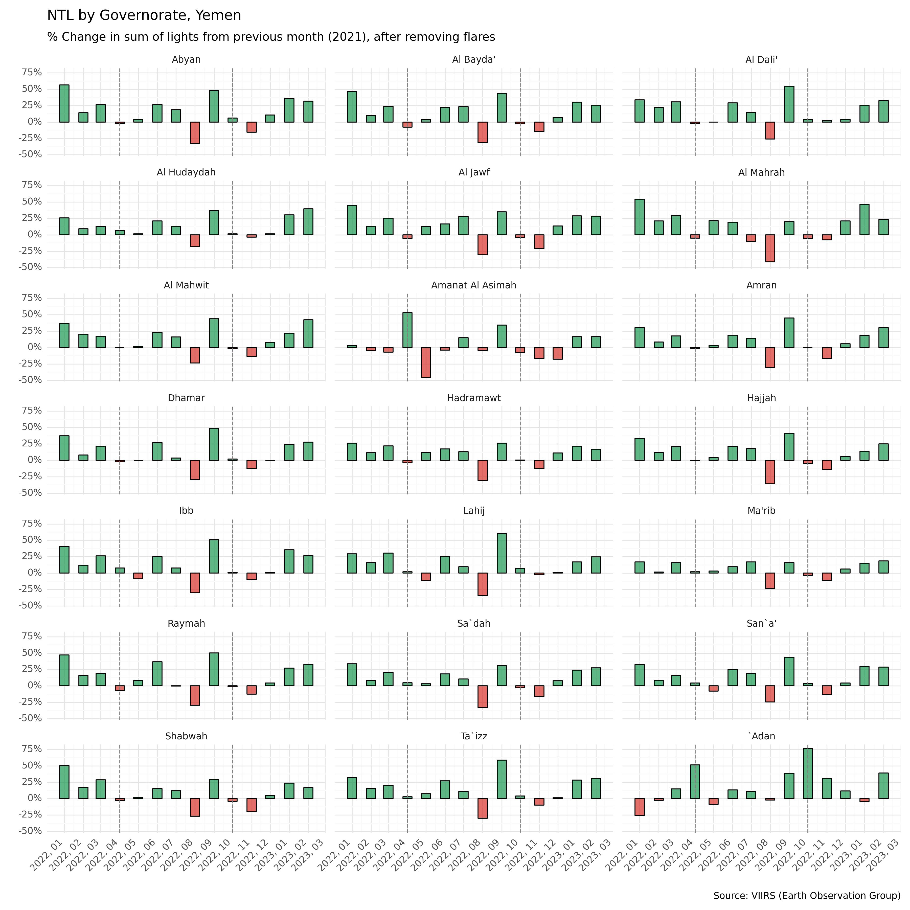
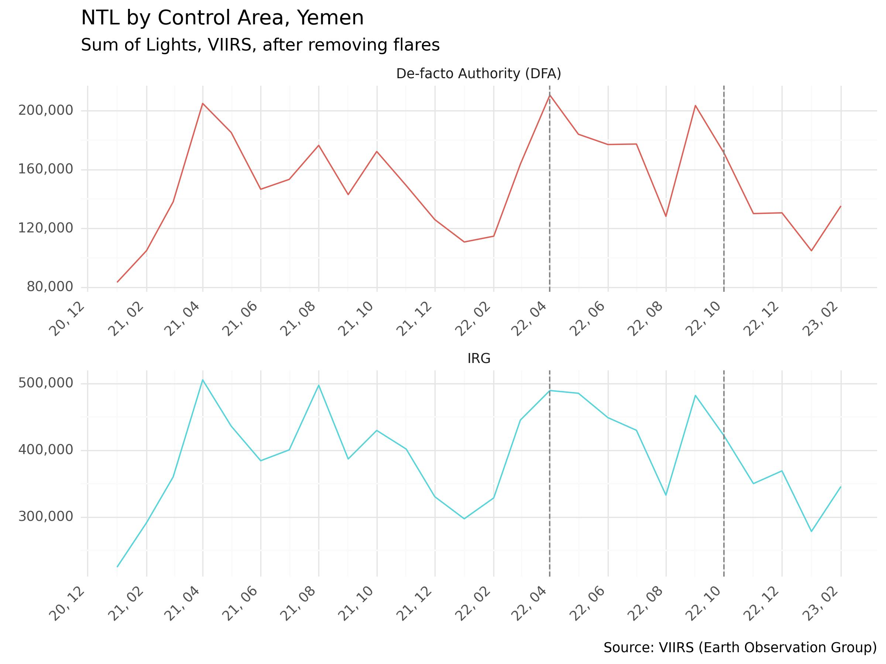
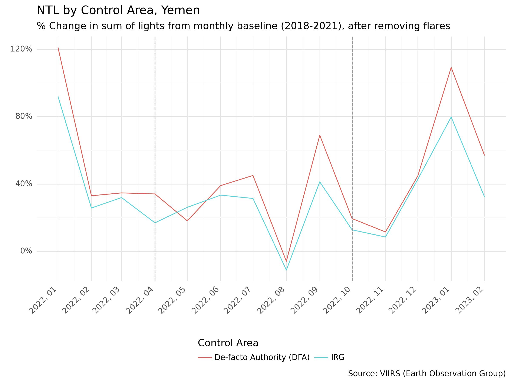
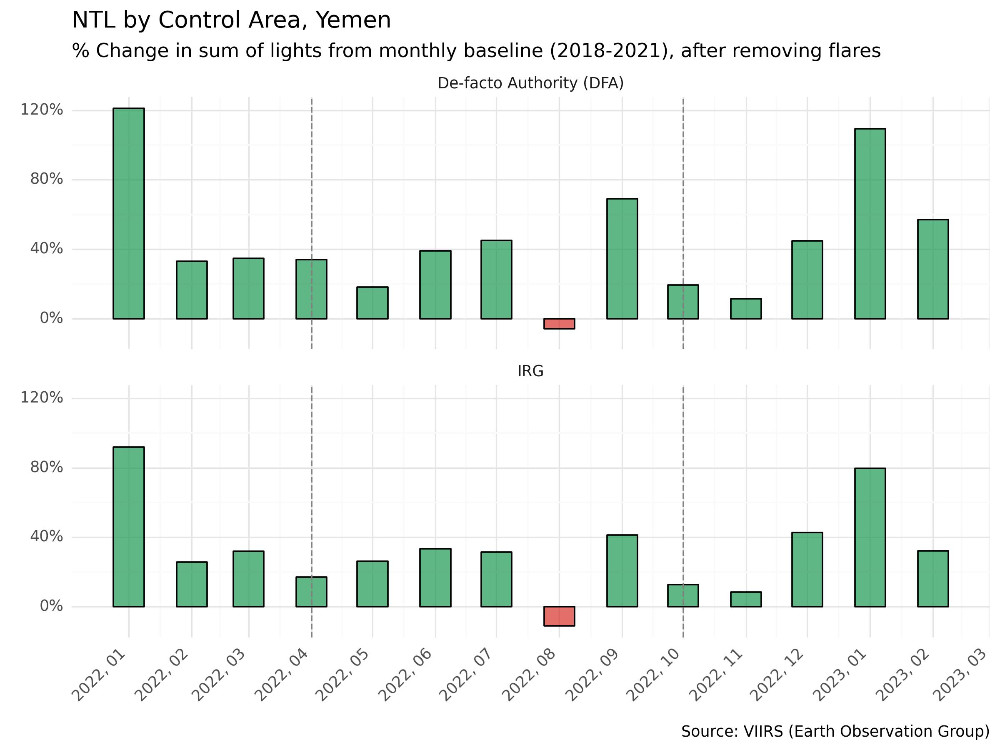
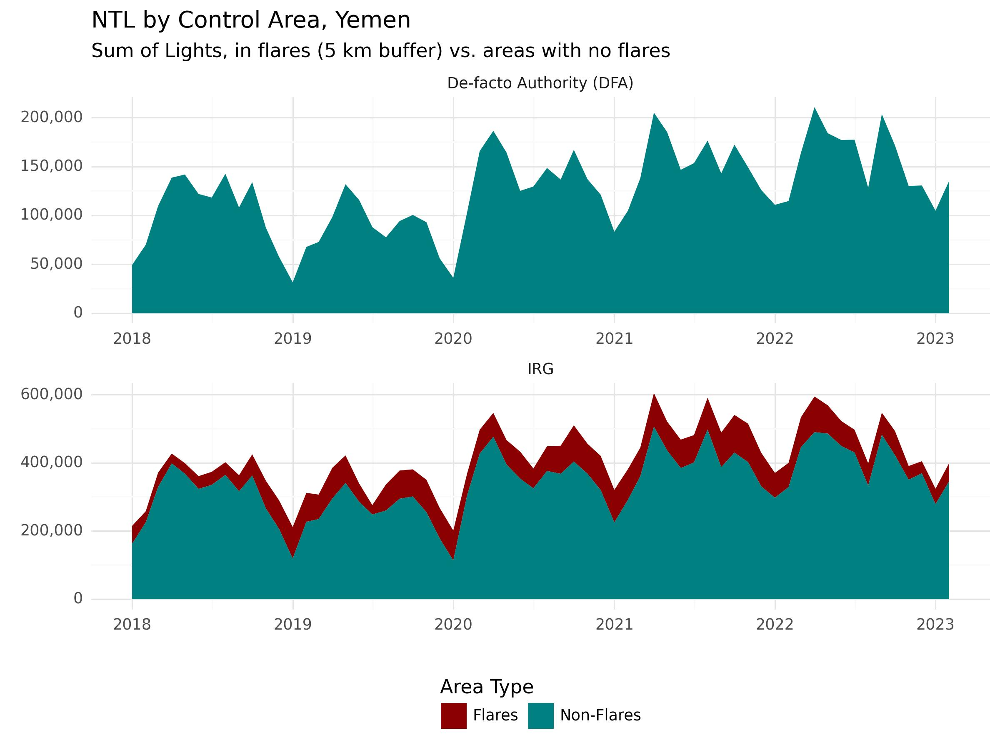
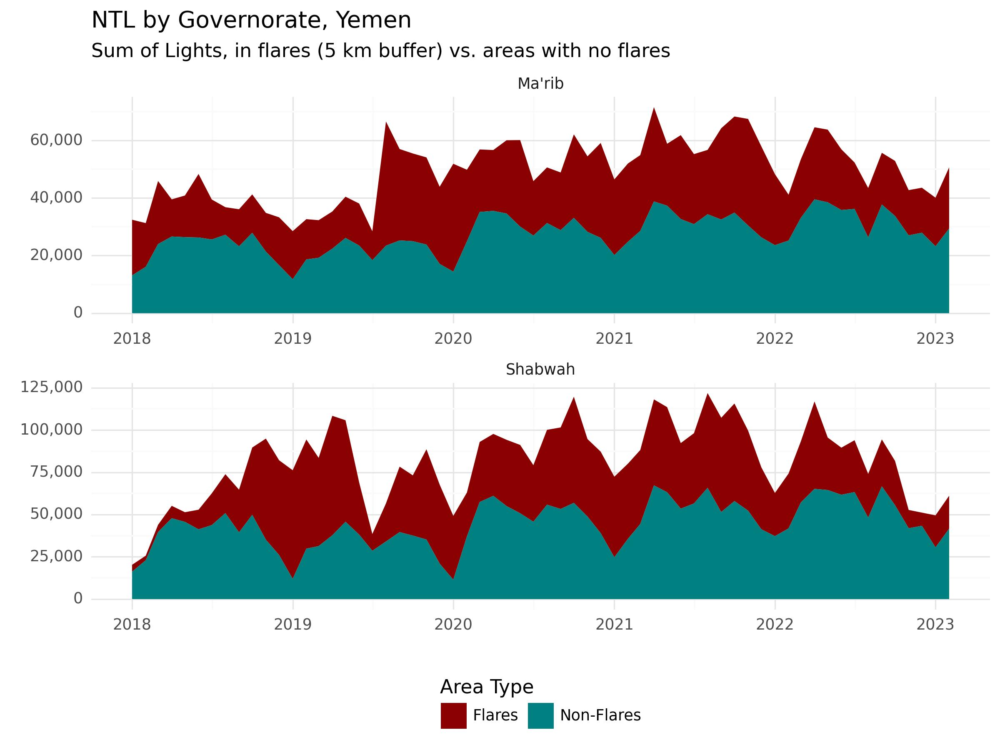

# Montioring Changes in Nighttime Lights in Yemen

## Assignment

Understanding how on-going conflict has impacted the Yemen economy can be challenging without routine survey collection or consistent government statistics. To help fill in the gaps, the World Bank MTI team responsible for preparing the Yemen Economic Monitor invited Lab colleagues to:

> 1. Pull and process nighttime light (NTL) imagery for all of Yemen, from January 2021 through latest available;
> 
> 2. Create two line charts, tracking monthly percent change (or other normalized index) of NTL by administrative level 1 (governorate), with markers for the period from 4/2022 to 10/2022, and another chart, with just two lines, for aggregated North (Houthis) and South (IRG) governorates; and
> 
> 3. Prepare a table with the raw data, that the team can use for further analysis and indexing.

## Data

#### Nighttime Lights

The team used monthly composites from the [Earth Observation Group](https://mcas-proxyweb.mcas.ms/certificate-checker?login=false&originalUrl=https%3A%2F%2Fdevelopers.google.com.mcas.ms%2Fearth-engine%2Fdatasets%2Fcatalog%2FNOAA_VIIRS_DNB_MONTHLY_V1_VCMCFG%3FMcasTsid%3D20893&McasCSRF=37807788db9949b5f9e1802d3415f43cf8072003919c339c8b17499915ca26e4) (EOG), available on Google Earth Engine and available through January 2023.

The team considered using raw imagery from [Black Marble](https://blackmarble.gsfc.nasa.gov/), which has been successfully used in other Bank projects, such as the Syria Economic Monitor, but in Yemen, abnormal spikes were observed during time periods where there were no valid observations due to clouds.These spikes may result from a gap-filling technique that is introducing too much noise to the data. 

To deal with this issue in the EOG data (which occurs only during a couple months in select governorates), the team implemented a moving-window linear regression to interpolate missing values at the pixel level. This method is presented in the [project notebook used to determine NTL trends at the governorate level](https://github.com/datapartnership/yemen-economic-monitor/blob/main/notebooks/ntl-yemen-adm1.ipynb). 

For more information about nighttime light imagery and alternative methods for accessing them, we recommend referring to the World Bank's [Light Every Night Guide](https://worldbank.github.io/OpenNightLights/wb-light-every-night-readme.html).

All NTL data have been stored on the [project SharePoint](https://worldbankgroup.sharepoint.com/:f:/t/DevelopmentDataPartnershipCommunity-WBGroup/EqV1m8Y_7BdEgDXPuCMbhZ4Beo-7vmUEGM8rDGvyRnJ57Q?e=7VkuGg), which can be made accessible to the project team. The tables contain monthly sum of lights from 2018 to present, aggregated at the admin-1 level and by control group (IRG or DFA). Additional tables that take into account flaring are also included and indicated by the term "masked."

#### Flaring Data

To dissaggregate NTL data generated by oil flaring activity, the team used data from the World Bank's [Global Gas Flaring Partnership](https://www.worldbank.org/en/programs/gasflaringreduction/global-flaring-data). The Partnership provides a dataset of geo-located flaring events based on observed lights and temperature. The team applied a 5 km buffer around flares and organized the data by year, from 2018 - 2023. Note that since there are no updatesto the Global Gas Flaring Partnesrhip after 2021, the team extrapolated the same events through 2023.

#### Control Area

For defining goverment control areas, the team used [ACAPS Yemen Areas of Control](https://data.humdata.org/dataset/yemen-areas-of-control), a bi-weekly dataset that includes tabular and geospatial data that are at the admin-2 level. These data are available under an open data license via [HDX](https://data.humdata.org/).

## Methodology and Implementation

Using the flare datasets described in the previous section ("Data"), the team alculated monthly nightime light sums, removing lights generated by flaring. The following graphs show the sum of observed nighttime lights by governorate, from January 2021 through January 2023.

Since NTL tend to exhibit seasonality trends, the team compared current values with a historical average for the same given month. To this end, the team pulled data from 2018 to establish four-year monthly averages from 2018-2021. Then, the team calculated the percentage change between the baseline and the current monthly value.  The following graphs show these monthly percent changes from January 2022 through January 2023, relative to the historical averages. The period from April 2022 through October 2022 have been marked with a dotted line.

In general, oberved nighttime lights have increased relative to previous years, though, some governorates show sharp decreases after April 2022, such as Amanat Al Asimah and Adan, and a notable decline after October 2022 observed in Ma'rib and Shabwah.

Next, we plotted a line chart that shows the sum of lights by control group, from January 2021 through January 2023.

Then, using the same method applied to all governorates for establishing a historical average, the team prepared pecent change bar and line graphs, by area of control.

Both the North and South follow very similar trends, with a slightly larger increase in observed lights in the North (DFA).

Finally, the team analyzed nightime lights from flaring. The line charts, below, show sum of lights by control area. It is noted that flaring activity is only observed in IRG-controlled areas. 

Since flaring activite is only observed in two governorates -- Ma'rib and Shabwah -- the team has created an additional chart showing the impact of flaring on nighttime lights.

#### Code Notebooks

* [Nightime Lights by Admin-1 Level](https://github.com/datapartnership/yemen-economic-monitor/blob/main/notebooks/NTL-notebooks/01-ntl-yemen-adm1.ipynb)

* [Nighttime Lights by Control Area](https://github.com/datapartnership/yemen-economic-monitor/blob/main/notebooks/NTL-notebooks/02-ntl-yemen-control.ipynb)

* [Nightime Lights by Admin-1 Level with Separated Flares](https://github.com/datapartnership/yemen-economic-monitor/blob/d38fd619dbf7e0d59a69c729b0dd40d8375f97ce/notebooks/NTL-notebooks/03-ntl-yemen-adm1-flares.ipynb)

* [Nighttime Lights by Control Area with Separated Flares](https://github.com/datapartnership/yemen-economic-monitor/blob/d38fd619dbf7e0d59a69c729b0dd40d8375f97ce/notebooks/NTL-notebooks/04-ntl-yemen-control-flares.ipynb) 

## Findings

As noted above, in general, oberved nighttime lights have increased relative to previous years, though, some governorates show sharp decreases after April 2022, such as Amanat Al Asimah and Adan, and a notable decline after October 2022 observed in Ma'rib and Shabwah. Further, in terms of control areas, both the North and South follow very similar trends, with a slightly larger increase in observed lights in the North (DFA).

Nightime lights from flaring were only observed in two governorates -- Ma'rib and Shabwah. 
